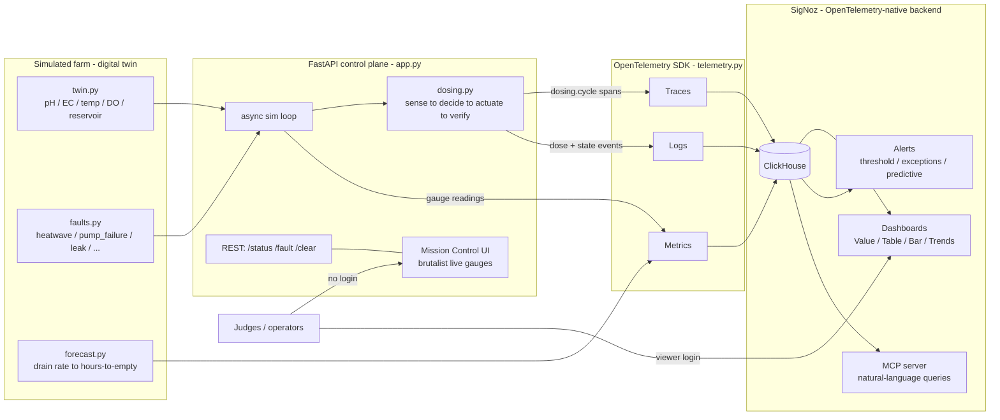

# 🌱 RootCause — Mission Control for a Hydroponic Farm

**Observability for a living system.** RootCause runs a physics-based digital twin of a
hydroponic grow rig and operates it like a **production service** on
[SigNoz](https://signoz.io): golden-signal metrics, a nutrient-dosing control loop rendered
as **distributed traces**, trace-correlated logs, exceptions, plant-health **SLOs**, and
alerts that **page you before your plants die**.

> Built for the **Agents of SigNoz** hackathon — **Track 03: Build Your Own**.

### 🔗 Live

| | URL |
|---|---|
| **Mission Control** (live gauges, no login) | **http://20.120.242.78:8099/** |
| **SigNoz** (dashboards, traces, alerts) | **http://20.120.242.78:8080/** |

---

## 👩‍⚖️ For judges — read-only access (no handoff needed)

You can review everything **without me present**:

1. **Mission Control — zero login.** Open **http://20.120.242.78:8099/**. You'll see the farm
   live, and you can **click the fault buttons yourself** (`heatwave`, `pump_failure`, `leak`, …)
   to trigger real incidents and watch the vitals react.
2. **SigNoz — shared read-only account.** Open **http://20.120.242.78:8080/** and sign in with
   the **viewer** credentials below (VIEWER role — can view dashboards, traces, and alerts,
   cannot edit):
   ```
   email:    judge@rootcause.demo
   password: SigNozJudge!2026
   ```
3. **Always-on proof.** If the demo VM is asleep, the **[demo video](#-demo)** and the
   screenshots in this README show the full incident walkthrough.

*(Maintainer note: create that viewer in SigNoz → Settings → Members → Invite → role VIEWER,
and disable it after judging.)*

---

## Contents
- [Why this is different](#why-this-is-different)
- [What's real vs. simulated](#whats-real-vs-simulated)
- [Architecture](#architecture)
- [Anatomy of a dosing trace](#anatomy-of-a-dosing-trace)
- [Quickstart](#quickstart)
- [Grow Room Mission Control](#grow-room-mission-control)
- [SigNoz setup](#signoz-setup)
- [Deploy & share](#deploy--share)
- [Repository layout](#repository-layout)
- [How it maps to the judging criteria](#how-it-maps-to-the-judging-criteria)

## Why this is different

Most observability demos watch software. RootCause watches a **living, physical system** —
and it turns out a hydroponic reservoir maps almost perfectly onto the concepts SREs use
every day:

| SRE concept | Hydroponic reality |
|---|---|
| **Distributed trace** | One nutrient-dosing cycle: `sensor.read → controller.decide → pump.actuate → sensor.verify` |
| **Golden signals** | pH, EC (nutrient strength), water temp, dissolved oxygen, water level |
| **SLO + error budget** | "pH stays in 5.5–6.5 for 99% of the day" |
| **Incident / SEV** | pH lockout, nutrient burn, **pump failure = total outage** |
| **Exception** | Dosing pump timeout, sensor returning `NaN` |
| **Predictive alert** | "Reservoir will be **dry in ~3h** at the current drain rate" |

A dosing cycle *is* a sense → decide → actuate → verify control loop — which is exactly the
shape of a distributed trace. That mapping is the whole idea, and it produces a screenshot no
judge in this hackathon has seen: **a flame graph of a plant being fed.**

## What's real vs. simulated

- **Simulated:** the *farm*. A physics-informed twin ([`twin.py`](rootcause/twin.py)) models
  diurnal light/temperature cycles, nutrient uptake (EC falls as plants drink), pH drift,
  oxygen solubility vs. temperature, and reservoir drain. The data is **synthetic but
  causal** — you can look at any signal and reason about *why* it moved. No `random()` spam.
- **100% real:** the *observability*. Real OpenTelemetry SDK, real OTLP export, real spans /
  metrics / logs / exceptions, real SigNoz dashboards and alerts.

Bring one cheap sensor (a $2 DHT22) and you can stream one **real** signal alongside the twin
— the pipeline doesn't care where the numbers come from.

## Architecture



## Anatomy of a dosing trace

Every control cycle is one trace — this is the money-shot:

```
dosing.cycle                         (zone=zone-a, crop=lettuce, converged=true)
├── sensor.read        ph.measured=6.42  ec.measured=1.44
├── controller.decide  corrections=ph_down,nutrient_ab  ph.error=+0.42
├── pump.actuate       pump.id=ph-pump-1     dose.ml=10.5      ← raises PumpTimeoutError
│                                                                 under the pump_failure fault
├── pump.actuate       pump.id=nutrient-pump-1  dose.ml=6.4
└── sensor.verify      ph.after=6.17  converged=true
```

Under `pump_failure`, `pump.actuate` records a `PumpTimeoutError` and the cycle turns into a
**red error trace** — visible in SigNoz's flame graph and caught by the exceptions alert.

## Quickstart

```bash
git clone https://github.com/Shrinet82/rootcause-hydro && cd rootcause-hydro
python3 -m venv .venv && source .venv/bin/activate
pip install -r requirements.txt

# offline sanity check first — no SigNoz needed, prints spans/metrics/logs to console:
PYTHONPATH=. ROOTCAUSE_CONSOLE=1 ROOTCAUSE_DISABLE_OTLP=1 python3 scripts/smoke_test.py

# then point it at YOUR SigNoz and stream for real:
cp .env.example .env          # set OTEL_EXPORTER_OTLP_ENDPOINT (default :4317)
python -m rootcause.run       # streams telemetry + serves Mission Control on :8099
```

Within a minute you'll see the `rootcause-hydro` service in SigNoz with metrics flowing and
`dosing.cycle` traces appearing.

## Grow Room Mission Control

**http://20.120.242.78:8099/** (or `localhost:8099`) — a bespoke **brutalist** operator screen:
radial gauges (pH, EC, water temp, O₂), a reservoir tank, a scrolling status ticker, a
vitals-aware incident banner (NOMINAL → DEGRADED → CRITICAL), and **fault-injection buttons**.

SigNoz stays the observability backend (traces, logs, metrics, alerts); this is the grower's
glance-screen on top of it, and it fills the one gap SigNoz has for a farm wall-display:
**radial gauges.**

## SigNoz setup

**Metrics emitted** (all tagged `zone`, `crop`, `stage`):
`hydro.ph` · `hydro.ec` · `hydro.tds` · `hydro.water_temp` · `hydro.air_temp` ·
`hydro.humidity` · `hydro.dissolved_oxygen` · `hydro.water_level` · `hydro.reservoir_volume` ·
`hydro.light_ppfd` · `hydro.co2` · `hydro.pump_flow` · `hydro.reservoir.hours_to_empty`

**Dashboards** ([`signoz/dashboards/`](signoz/dashboards), import from the UI or
`python signoz/apply_signoz.py --create`) — panel types matched to each signal:
- **Grow Room Overview** — current vitals as **Value** tiles + pH/EC **trend** lines.
- **Reservoir & Dosing** — reservoir/pump **Value** tiles + nutrient & pump **trends**.
- **Plant-Health SLO** — a **Table** scorecard (metric · current · target) + SLO trend lines.

**Alerts** — step-by-step + the fault that fires each in [`signoz/ALERTS.md`](signoz/ALERTS.md):

| Alert | Rule | Fire with |
|---|---|---|
| Water temp critical | `hydro.water_temp` > 24 | `heatwave` |
| Dissolved O₂ low | `hydro.dissolved_oxygen` < 5 | `heatwave` |
| Reservoir dry soon (predictive) | `hydro.reservoir.hours_to_empty` < 3 | `leak` |
| Pump actuation failure (exceptions) | `PumpTimeoutError` count > 0 | `pump_failure` |
| pH / EC out of band | `hydro.ph`, `hydro.ec` outside band | `ph_drift`, `nutrient_burn` |

## Deploy & share

- **Mission Control → a public URL:** self-contained (renders the gauges with no SigNoz), so
  deploy the `Dockerfile` to **Render** (`render.yaml`), **Fly.io** (`fly.toml`), or any Docker
  host. Judges get a clickable page — gauges *and* live fault buttons.
- **SigNoz → share it:** run it on a VM (as here) or tunnel your local instance with
  `cloudflared tunnel --url http://localhost:8080`.

Full guide: [`DEPLOY.md`](DEPLOY.md). Demo script: [`DEMO.md`](DEMO.md). Write-up: [`BLOG.md`](BLOG.md).

## Repository layout

```
rootcause/
  twin.py         # physics-informed digital twin (the "farm")
  telemetry.py    # OpenTelemetry: traces + metrics + logs, one place
  dosing.py       # control loop rendered as dosing.cycle traces
  faults.py       # injectable fault scenarios (shared source of truth)
  forecast.py     # online reservoir drain forecaster (predictive alert)
  app.py          # FastAPI control plane + background sim loop
  dashboard.html  # brutalist Mission Control UI (served at /)
  run.py / cli.py # entrypoint + demo CLI
signoz/
  apply_signoz.py # generate/create dashboards; print alert specs
  dashboards/*.json
  ALERTS.md       # how to create + fire each alert
scripts/smoke_test.py
Dockerfile · render.yaml · fly.toml · DEPLOY.md · DEMO.md · BLOG.md
```

## 🎬 Demo

See [`DEMO.md`](DEMO.md) for the shot-by-shot 2-minute script: green baseline → inject
`pump_failure` → error trace + alert pages → inject `leak` → "dry in ~Xh" → recover.

## How it maps to the judging criteria

- **Potential Impact** — crop loss is money; vertical farming is a real, growing domain.
- **Creativity** — observability on a *living* system; a dosing loop as a distributed trace.
- **Technical Excellence** — causal digital twin, clean OTel semantic conventions, SLOs.
- **Best Use of SigNoz** — traces **and** metrics **and** logs **and** exceptions **and**
  dashboards (Value/Table/Bar/Trends) **and** four alert types (threshold, exception, anomaly,
  predictive).
- **User Experience** — a control plane + gauges a grower would actually watch.
- **Presentation** — a fault-injection demo arc with a memorable money-shot.

## License

MIT — see [LICENSE](LICENSE).
